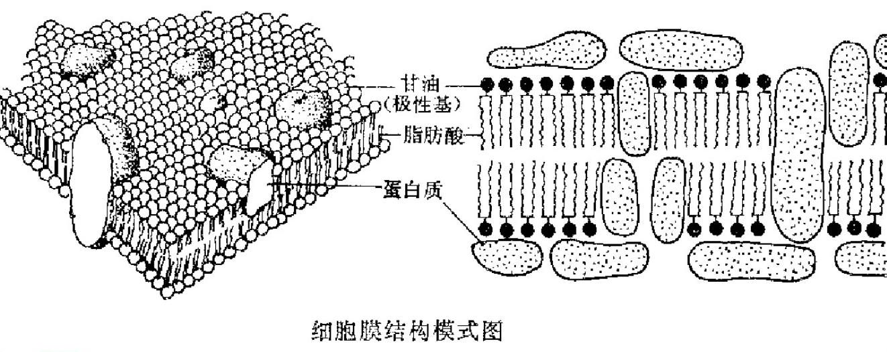

# 微生物生理考点

```markmap
---
markmap:
  zoom: false
  pan: false
  height: 300px
  backgroundColor: "#f8f8f8"
---

# 微生物生理考点
## 名词解释
## 简答题
### 第二章 2.2 原生质膜及内膜系统
#### 细胞质膜结构
#### 原核微生物与真核生物细胞膜的不同
#### 古生物的细胞质膜
#### 细胞膜的生理功能
### 第三章 3.1 微生物对小分子营养物质的吸收
#### 物质的运输
#### 单纯扩散
#### 促进扩散
#### 主动运输
### 第五章 2.6 发酵
### 第九章 4.6 营养条件对次级代谢的调控
### 第十一章 第 7 节 微生物的抗药性及对金属离子的抗性
## 论述题
### 第五章 2.3 单糖的降解
## 作图题
### 第六章加的内容
```

## 名词解释

**肽聚糖（peptidoglycan）：** 肽聚糖是由多糖链经短肽相交联而形成的网络状分子，是真细菌细胞壁特有成分，构成细菌细胞壁坚硬的骨架部分。

**脂多糖（lipolysaccharide）：** 简称 LPS，位于 G^-^ 细胞壁最外层的一层较厚（8~10 nm）的类脂多糖类物质。

**磷壁酸（techoic acid）：** 磷壁酸春在于所有 G^+^ 中，是磷酸核糖醇或磷酸甘油的重复单位通过磷酸二酯键连接的聚合体。

**假肽聚糖（pseudomurein）：** 甲烷杆菌科中的甲烷杆菌属和甲烷短杆菌属的细胞壁中由 *N*-乙酰氨基葡萄糖或 *N*-乙酰氨基半乳糖和 *N*-乙酰塔罗糖醛酸与三种氨基酸：L-赖氨酸、L-谷氨酸、L-丙氨酸或苏氨酸组成的类似肽聚糖的结构，称为假肽聚糖。

**基团转移（group translocation）：** 如果营养物质在通过原生质膜的转移过程中发生化学变化，如营养物质被磷酸化，这样的运输方式称为集团转移。

**HPr（heat stable carrier protein）：** 热稳定性载体蛋白（组氨酸蛋白），由简单多肽链组成，能像高能磷酸载体一样起作用，是非特异性的磷酰基载体蛋白。

**发酵作用（fermentation）：** 指微生物在无外源电子受体时，底物脱下的氢或电子未经呼吸链的传递而直接交给底物未完全氧化的中间产物，以底物水平磷酸化产生的 ATP 的生物氧化过程。

**无氧呼吸（anaerobic respiration）：** 以 O~2~以外的外源物质作为电子传递链末端电子受体的生物氧化过程叫做无氧呼吸。

**自由能：** 凡是能够用于做功的能量都称为自由能，总能量中只有一部分能转化为功即表现为自由能。

**化能自养菌：** 一些微生物可以通过氧化无机物获得能量，同化合成细胞物质，这类细菌称为化能自养菌。

**斯提克兰反应（Stick land 反应）：** 在厌氧条件下，一种氨基酸进行氧化脱氢，脱下去的氢去还原另一种氨基酸，使之发生还原脱氢，二者偶联进行氧化还原的脱氢作用。

**糖核苷酸（sugar nucleotides）：** 单糖和核苷二磷酸结合生成的衍生物，能量高于 ATP，在多糖合成中可以不用 ATP。

**回补途径：** 指能补充兼用代谢途径中因合成代谢而消耗的中间代谢产物的反应。回补主要来自转氨基酶催化的反应和某些化合物的 CO~2~ 固定及乙醛酸循环。

**乙醛酸循环：** 在异柠檬酸裂解酶催化下，异柠檬酸被直接分解为乙醛酸，乙醛酸又在乙酰辅酶 A 参与下，由苹果酸合成酶催化生成苹果酸，苹果酸氧化脱氢生成草酰乙酸的过程。

**次级代谢：** 指存在于某些生物中，并在一定的生长期内（通常在生长后期或稳定期）出现的一类特殊的代谢类型，是某些微生物为了避免在代谢过程中，某种代谢产物的积累造成的不利作用而产生的一类有利于生存的代谢类型。

**生源（biogen）：** 指次级代谢产物分子构建单位的来源。一般生源是直接或间接地来自于微生物代谢过程产生的一些中间产物和初级代谢产物。

**能荷（EC）：** 总的腺苷酸系统中（即 ATP、ADP、AMP 体系）所负荷的高能磷酸键的度量，其数值在 0~1 之间，是衡量细胞（或线粒体）能量状态的参数。

**协同诱导（coordinated induction）：** 加入一种诱导剂后，微生物能同时或几乎同时合成几种酶，主要存在于较短的代谢途径中，合成这些酶的基因由同一个操纵子所控制。

**顺序诱导（sequential induction）：** 第一种酶的底物会诱导第一种酶的合成，第一种酶的产物又会诱导第二种酶的合成，以此类推合成一系列的酶。顺序诱导常见于较长的用来降解好几个底物的降解途径。

**巴斯德效应（The Pasteur effect）：** 在有氧情况下，由于呼吸作用，酒精产量大大下降，糖的消耗速率大幅度减慢。即有氧呼吸抑制发酵的作用。

**同步生长：** 一个群体中每一个细胞在生活周期中都处于相同的生长阶段。

**连续培养（continuous culture）：** 在细菌生长的整个生长期间通过一定的方式使细菌能以恒定的比生长速率进行生长，并使细菌生长能不断进行下去的一种培养方式。

**趋化性（chemotaxis）：** 是指由于化学物质的种类与浓度不同引起微生物产生的一种向性或背向性运动。

**趋向性（taxis）：** 微生物对环境中的物理、化学或生物因子做出的有方向性的应答运动。

## 简答题

### 第二章 2.2 原生质膜及内膜系统

#### 细胞质膜结构

**细胞质膜（cytoplasmic membrane）** 又称质膜、细胞膜或内膜。是富有弹性的半透性薄膜，厚度约为 7~8nm，约占细胞干重的 10%，是十分重要的亚细胞结构，缺少将导致细胞死亡。

**分离方法：** 用平衡密度梯度离心法，可从破碎的原生质体悬液中分理出膜碎片。主要成分为脂类和蛋白质，以及少量多糖。
$$
细胞膜
\begin{cases}
\text{磷脂}& \text{占 20\% - 35\%} \\
\text{蛋白质}& \text{占 50\% - 65\%}
\end{cases}
$$

脂类在不同类型的微生物中的种类和重量都不一样，原核生物主要脂类有磷脂、糖脂和鞘脂等 **极性脂类**，还有一些 **非极性脂类**：泛醌、萘醌（WitK）、类胡萝卜素，菌质体中的胆固醇等，量很少但作用不可忽视。

细胞膜上的 **膜蛋白** 可分为：

1. 与 **细菌呼吸** 有关的酶；
2. 与 **物质运输** 有关的酶；
3. 与 **合成** 有关的酶。



细胞质膜结构是一种夹心结构，称为 **单位膜**，其功能多样化，取决于它的组分空间排列。

#### 原核微生物与真核生物细胞膜的不同

细胞膜一般不包含 **胆固醇** 等甾醇。多烯类抗生素（制霉菌素、灰黄霉素、两性霉素 B）因可破坏含甾醇的细胞质膜，故可抑制支原体和真核生物，但对其他原核生物无抑制作用。

#### 古生物的细胞质膜

具有 **脂类** 和 **结构** 上的独特性：

* 单分子层膜多存在于嗜高温的古生菌中，其原因可能是因为这种膜的机械强度要比双分子层质膜更高
* 仅嗜盐菌类已发现有细菌红素（组成红膜）、$\alpha$ - 胡萝卜素、$\beta$ - 胡萝卜素、番茄红素、视黄醛可与蛋白质结合成视紫红质和萘醌等。

<center> <strong> 真细菌与古细菌细胞膜的比较 </strong> </center>

| 种类               | 真细菌     | 古细菌                 |
| ------------------ | ---------- | ---------------------- |
| 亲水头与疏水尾连接 | 酯键       | 醚键                   |
| 疏水尾成分         | 脂肪酸     | 异戊二烯重复单位       |
| 单分子层膜         | 无         | 有                     |
| 甘油上连接物       | 磷脂酰甘油 | 磷酸酯、硫酸酯、糖基等 |
| 膜上含独特脂类     | 无         | 有                     |

#### 细胞膜的生理功能

1. 选择性地控制细胞内、外的营养物质和代谢产物的运送；
2. 维持细胞内正常渗透压的屏障；
3. 合成细胞壁和糖被的各种组分（肽聚糖、磷壁酸、LPS、荚膜多糖等）的重要基地；
4. 膜上含有氧化磷酸化或光合磷酸化等能量代谢的酶系，是细胞的产能场所；
5. 是鞭毛基体的着生部位和鞭毛旋转的供能部位。

### 第三章 3.1 微生物对小分子营养物质的吸收

#### 物质的运输

微生物在生长过程中，所需阴阳物质不断的进入细胞，代谢产物及时的分泌到细胞外，这两个过程就是 **物质的运输**。
$$
营养物质
\begin{cases}
\text{能否进入细胞} \\
\text{能够利用（即是否具有酶系）}
\end{cases}
$$
微生物的细胞表面由荚膜、粘液层、细胞壁和细胞质膜构成渗透屏障，但主要与细胞质膜有关。膜对营养物质的吸收具有选择性，是一种半透膜。
$$
运输方式
\begin{cases}
\text{不通过膜上载体蛋白：单纯扩散} \\
\text{通过膜上载体蛋白}
    \begin{cases}
    \text{不耗能：促进扩散} \\
    \text{耗能}
		\begin{cases}
		\text{运输前后溶质分子不变：主动运输}\\
		\text{运输前后溶质分子改变：基团转运}
		\end{cases}
    \end{cases}
\end{cases}
$$

#### 单纯扩散

* 依靠胞内外溶液浓度差，顺浓度梯度运输；
* 不消耗代谢能，无特异性；
* 运输氧、二氧化碳、甘油、乙醇、某些氨基酸等小分子；
* 亲脂性分子从高浓度到低浓度的扩散来运输，利用细胞膜的通透性。


单纯扩散对营养物质的运输缺乏选择能力和逆浓度梯度的“浓缩”能力，不是细胞获取营养物质的主要方式。

#### 促进扩散

* 利用膜内、膜外被运输物质和载体蛋白的亲和力不同。
* 促进扩散特点：
  * 需要特异性的载体蛋白顺浓度梯度运输；
  * 不消耗能量；
  * 载体蛋白对被运送的物质具有较高的专一性；
  * 运输硫酸根、磷酸根、氨基酸、维生素、糖（真核）。

**载体蛋白** 即透性酶（大多为诱导酶），有底物特异性，每种载体蛋白运输相应的物质。载体蛋白可加快运输速度，但不能逆浓度运输。


载体只影响物质的运输速率，并不改变物质在膜内外形成的动态平衡状态。

**离子载体** 是一类可溶于脂质素昂分子层的疏水性小分子，通过提高膜的离子通透性而促进离子进行跨膜运输。大多数是由微生物合成，有的就是抗生素。


#### 主动运输

* 是微生物吸收营养的主要方式；
* 可逆浓度梯度运输，耗能（**能量来源 2 种：质子动力和 ATP 动力**）；
* 需载体蛋白，有特异性；
* 运输有机离子、无机离子、氨基酸、乳糖等糖类；
* 需要特异性载体蛋白、需要能量来改变载体蛋白的构象；
* 亲和力改变 $\rightarrow$ 蛋白构象改变 $\rightarrow$ 耗能。


1. 电子转移能被用来将质子泵出膜外；
2. 质子梯度通过 **逆向运输机制** 将钠离子逐出膜外；
3. 钠离子与载体蛋白复合物结合；
4. 溶质结合位点的形状发生改变，而与溶质结合；
5. 载体蛋白的构象发生改变，钠离子在膜内释放，随后溶质从载体蛋白解离（**同向运输机制**）。

> 主动运输机制：使用质子（H^+^）动力和钠离子（Na^+^）梯度。

**主动运输中载体蛋白的运输模式：** 单项运输、同向运输、逆向运输


#### 基团移位

基团移位的运送机制在 *E.coli* 中研究得较为清楚，主要靠 **磷酸转移酶系统（PTS）** 即磷酸烯醇式丙酮酸-己糖磷酸转移酶系统进行。

具体分 **两步** 进行：

1. 热稳定性载体蛋白的激活
   $$
   \text{PEP} + \text{HPr} \xleftrightharpoons{\text{EI}} \text{丙酮酸} + \text{P-HPr}
   $$

2. 糖磷酸化后运入膜内
   $$
   \text{P-HPr} + \text{糖} \xleftrightharpoons{\text{EI}} \text{糖-P} + \text{HPr}
   $$
   


#### 四种运送营养物质方式的比较

| 比较项目         |             单纯扩散              |           促进扩散           |                    主动运输                     |                  基团转位                  |
| :--------------- | :-------------------------------: | :--------------------------: | :---------------------------------------------: | :----------------------------------------: |
| 特异载体蛋白     |                无                 |              有              |                       有                        |                     有                     |
| 运送速度         |                慢                 |              快              |                       快                        |                     快                     |
| 溶质运送方向     |             由浓到稀              |           由浓到稀           |                    由稀到浓                     |                  由稀到浓                  |
| 平衡时内外浓度   |             内外相等              |           内外相等           |                 内部浓度高得多                  |               内部浓度高得多               |
| 运送分子         |             无特异性              |            特异性            |                     特异性                      |                   特异性                   |
| 能量消耗         |              不需要               |            不需要            |                      需要                       |                    需要                    |
| 运送前后溶质分子 |               不变                |             不变             |                      不变                       |                     变                     |
| 载体饱和效应     |                无                 |              有              |                       有                        |                     有                     |
| 与溶质类似物     |             无竞争性              |           有竞争性           |                    有竞争性                     |                  有竞争性                  |
| 运送抑制剂       |                无                 |              有              |                       有                        |                     有                     |
| 运送对象举例     | $H_2O$、$CO_2$、$O_2$、甘油、乙醇 | $SO_4^{2-}$、$PO_4^{3-}$、糖 | 氨基酸、乳糖等糖类、$Na^+$、$Ca^{2+}$等无机离子 | 葡萄糖、果糖、甘露糖、嘌呤、核苷、脂肪酸等 |

### 第五章 2.6 发酵

#### 发酵作用

* 发酵（狭义）：**在**没有外源电子受体**时，微生物将有机物氧化放出的电子直接交给底物本身未完全氧化的某一中间产物，产生各种不同的代谢产物，同时放出能量的过程。
  $$
  \text{底物-}H_2 \xrightarrow[\text{中间代谢物}\curvearrowright \text{中间代谢物-}H_2]{ADP\xrightarrow{\text{无氧下}}ATP} \text{底物}
  $$

* 工业上（广义）：发酵是指任何利用好氧或厌氧微生物来生产有用代谢物的一类生产方式。

发酵的特点：

* 通过底物水平磷酸化产ATP；
* 葡萄糖氧化不彻底，大部分能量存在于发酵产物中；
* 产能率低；
* 产多种发酵产物。

### 第九章 4.6 营养条件对次级代谢的调控


### 第十一章 第 7 节 微生物的抗药性及对金属离子的抗性


## 论述题

### 第五章 2.3 单糖的降解


## 作图题

### 第六章加的内容

